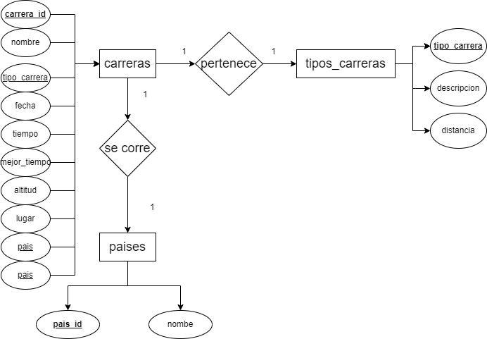
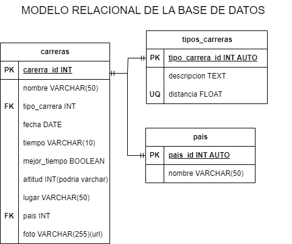

# Maratones

## Listado de entidades

### carreras **(ED)**

- carrera_id **(PK)**
- nombre
- tipo_carrera **(FK)**
- fecha
- tiempo
- mejor_tiempo (boolean)
- altitud
- lugar
- pais **(FK)**
- foto

### tipos_carreras (EC)

- tipo_carrera **(PK)**
- descripcion
- distancia **UQ**

### paises (EC)
- pais_id **(PK)**
- pais_nombre

## Relaciones

1. Una **carrera** _pertenece_ a un **tipo de carrera**. (_1 a 1_)
1. Una **carrera** _se corre_ en un **pais**. (_1 a 1_)

## Diagramas

### Modelo Entidad - Relacion

### Modelo Relacional de BD

## Reglas de Negocio 

### carreras

1. Crear el registro una carrera.
1. Leer el registro de una(s) carrera(s) dada una condición.
1. Leer todos los registros de la entidad carreras.
1. Actualizar los datos de una carrera dada una condición.
1. Eliminar los datos de una carrera dada una condición. 

### tipos_carreras

1. Todos los valores del atributo distancia deberán estar expresados en _km_ y no se podrán repetir. (no CRUD)
1. Crear el registro un tipo de carrera.
1. Leer el registro de un(os) tipo(s) de carrera(s) dada una condición.
1. Leer todos los registros de la entidad tipos carreras.
1. Actualizar los datos de un tipo de carrera dada una condición.
1. Eliminar los datos de un tipo de carrera dada una condición.

### paises

1. Crear el registro un país.
1. Leer el registro de un(os) pais(es) dada una condición.
1. Leer todos los registros de la entidad paises.
1. Actualizar los datos de un país dada una condición.
1. Eliminar los datos de un país dada una condición.